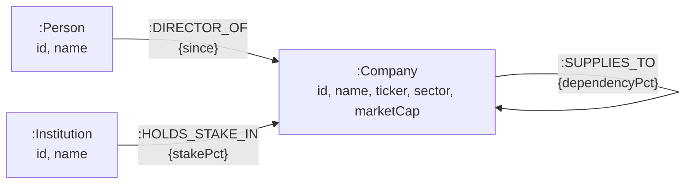

# EquityGraph

> **Note on sample data:** Company, director, and institutional holder names in this demo use real public company/individual names for realism, but all board memberships, supply relationships, and institutional stakes shown are fabricated sample data for demonstration purposes only — not real corporate relationships.

---

## Live Demo

- **Frontend Application:** [https://equity-graph.netlify.app](https://equity-graph.netlify.app)
- **Backend Health Check:** [https://equity-graph.onrender.com/api/health/db](https://equity-graph.onrender.com/api/health/db)

> **Note on Free-Tier Hosting:** The backend is hosted on Render's free tier and will spin down after periods of inactivity. If the service is idle, the initial request may experience a cold start latency of 30–60 seconds while the container spins up.

---

## Use Case

EquityGraph surfaces hidden relationship risk between publicly listed companies — risk that doesn't show up in any single company's financials. Three signals are modeled: shared board directors between companies (governance/influence overlap), multi-tier supply chain dependencies (operational risk), and shared institutional shareholders (correlated ownership risk).

A graph database fits this problem better than a relational one because the core questions are inherently traversal-based — "find all paths within N hops," "find the shortest connection between two entities" — which require recursive joins in SQL but are native, first-class operations in Cypher. As relationship depth or company count grows, a graph model scales this kind of query far more naturally than a relational schema would.

---

## Architecture & Design Decisions


**Backend — Vertical Slice Architecture** Each feature (e.g. `GetBoardInterlocks`) is a self-contained folder with its own Query, Handler, and Response — the entire request-to-response flow for one feature lives in one place, rather than being spread across Controller/Service/Repository layers. This was a deliberate trade-off: with 6 largely-independent read queries and no significant shared business logic between them, layered architecture would have added indirection without adding safety. VSA also directly serves the assignment's own framing — "a codebase you'd be comfortable walking through line by line" is easier to satisfy when one folder is the whole story.

**Query/Handler separation** Each feature still splits its request shape (Query, a plain record) from its execution logic (Handler, injected with `ICypherReader`). This buys unit-testability — handler logic can be tested with a mocked `ICypherReader`, with zero HTTP pipeline involved — without the overhead of a mediator library.

**`ICypherReader` as the single database abstraction**, rather than a repository per feature. Since each feature's query is genuinely different in shape, a generic repository interface would have fought the tool; a thin, shared "run this Cypher, map these records" helper gave each handler direct control over its own query while still centralizing session lifecycle and connection handling.

**Frontend — Angular standalone components with signals**, not NgModules or a state-management library like NgRx. Given the app is read-only with no complex cross-component shared state, plain component-level signals were sufficient — NgRx would have been the frontend equivalent of over-architecting the backend with unnecessary CQRS tooling.


---

## Tech Stack

### Backend
- **Framework & Runtime:** .NET 8 SDK (`net8.0`), ASP.NET Core Minimal APIs
- **Database Driver:** `Neo4j.Driver` (v6.3.0) communicating via Bolt protocol
- **Database Provider:** CognoDB Cloud (Managed Graph Database)
- **Configuration & Environment:** `DotNetEnv` (v3.2.0), `Microsoft.Extensions.Options`
- **API Documentation:** `Swashbuckle.AspNetCore` (v6.6.2), `Microsoft.AspNetCore.OpenApi` (v8.0.13)
- **Testing & Tooling:** xUnit (`xunit` v2.5.3), Moq (`Moq` v4.20.72), FluentAssertions (`FluentAssertions` v8.10.0), Coverlet (`coverlet.collector` / `coverlet.msbuild` v10.0.1)
- **Containerization:** Dockerfile (Multi-stage build on `mcr.microsoft.com/dotnet/aspnet:8.0`)

### Frontend
- **Framework & Runtime:** Angular 19 (`@angular/core` v19.2.0) with Standalone Components & Signals
- **Language:** TypeScript (`typescript` v5.7.2)
- **Reactive Programming:** RxJS (`rxjs` v7.8.0)
- **Styles:** Modular SCSS
- **Deployment:** Netlify with SPA redirect routing rules (`_redirects`)

---

## Project Structure

```text
equity-graph/
├── .env.example                     # Sample configuration template
├── README.md                        # Project documentation
├── backend/
│   ├── EquityGraph.sln              # Backend solution file
│   ├── src/
│   │   └── EquityGraph.Api/         # ASP.NET Core 8 Web API
│   │       ├── Features/            # Vertical Slice Architecture feature folders
│   │       │   ├── Companies/       # Company query endpoints, handlers, and DTOs
│   │       │   │   ├── GetBoardInterlocks/
│   │       │   │   ├── GetCompanyDetail/
│   │       │   │   ├── GetInstitutionalOverlap/
│   │       │   │   ├── GetShortestPath/
│   │       │   │   ├── GetSupplyChainExposure/
│   │       │   │   └── ListCompanies/
│   │       │   └── Health/          # Health check endpoint
│   │       │       └── CheckDbHealth/
│   │       ├── Shared/              # Shared cross-cutting infrastructure
│   │       │   ├── CognoDb/         # Driver factory and Cypher reader abstraction
│   │       │   ├── Middleware/      # Global exception handling middleware
│   │       │   └── Models/          # Shared domain records and models
│   │       ├── Dockerfile           # Multi-stage production container definition
│   │       └── Program.cs           # API entry point, DI, middleware, and route mapping
│   └── tests/
│       └── EquityGraph.Api.Tests/   # Unit test suite (xUnit + Moq)
│           └── Features/            # Feature-specific handler unit tests
├── frontend/
│   └── equity-graph-ui/             # Angular 19 Single Page Application
│       ├── src/
│       │   ├── app/
│       │   │   ├── core/            # Core singleton services and API clients
│       │   │   ├── features/        # Routed feature views (home, detail, path finder)
│       │   │   └── shared/          # Reusable UI components, pipes, and models
│       │   ├── environments/        # Environment configurations (local & production API URLs)
│       │   └── styles.scss          # Global style tokens and theme definitions
│       ├── angular.json             # Angular CLI workspace configuration
│       └── package.json             # NPM dependencies and scripts
├── seed/
│   ├── SeedRunner/                  # .NET console tool to execute idempotent seed script
│   │   └── Program.cs
│   ├── data-sources.md              # Documentation on seed dataset structure
│   ├── run_seed.sh                  # Shell script wrapper for database seeding
│   └── seed_data.cypher             # Cypher seed statements using idempotent MERGE
└── docs/
    └── screenshots/                 # Application screenshots and demo captures
```

---

## API Endpoints

All endpoints return JSON responses with standard HTTP status codes (`200 OK`, `400 Bad Request`, `404 Not Found`, `500 Internal Server Error`).

| Method | Route | Description |
| :--- | :--- | :--- |
| `GET` | `/api/health/db` | Health check verifying Bolt connectivity and query execution against CognoDB. |
| `GET` | `/api/companies` | List all companies with optional `search` (name or ticker substring) and `sector` query filtering. |
| `GET` | `/api/companies/{companyId}` | Retrieve detailed company profile including directors, direct suppliers, customers, and top institutional shareholders. |
| `GET` | `/api/companies/{companyId}/board-interlocks` | Identify shared board directors and all interconnected companies linked through common board seats. |
| `GET` | `/api/companies/{companyId}/supply-chain-exposure` | Analyze multi-tier upstream suppliers and downstream customers with configurable depth via `maxHops` (default `1`, max `3`). |
| `GET` | `/api/companies/overlap` | Compute institutional ownership overlap and identify common shareholders between two companies (`companyIdA`, `companyIdB`). |
| `GET` | `/api/companies/shortest-path` | Discover the shortest relationship chain between two companies (`fromCompanyId`, `toCompanyId`) across all relationship types. |

---

## Data Model

The EquityGraph domain is modeled as a property graph in CognoDB, capturing relationships across public corporations, individual board directors, and institutional investors.



```text
(:Person)      ──[:DIRECTOR_OF {since}]─────────────► (:Company)
(:Company)     ──[:SUPPLIES_TO {dependencyPct}]─────► (:Company)
(:Institution) ──[:HOLDS_STAKE_IN {stakePct}]───────► (:Company)
```

### Node Labels

- **`:Company`** — Represents a public corporate entity.
  - `id` (`string`): Unique company identifier (e.g., `'comp-1'`).
  - `name` (`string`): Full corporate name (e.g., `'Tata Consultancy Services'`).
  - `ticker` (`string`): Public market ticker symbol (e.g., `'TCS.NS'`).
  - `sector` (`string`): Industry sector classification (e.g., `'Information Technology'`, `'Automotive'`, `'Financial Services'`, `'Semiconductors'`, `'Automotive Components'`).
  - `marketCap` (`double`): Total market capitalization in USD.

- **`:Person`** — Represents an individual corporate executive or board member.
  - `id` (`string`): Unique person identifier (e.g., `'person-1'`).
  - `name` (`string`): Full name of the director (e.g., `'Natarajan Chandrasekaran'`).

- **`:Institution`** — Represents an institutional investment fund, asset manager, or sovereign entity.
  - `id` (`string`): Unique institution identifier (e.g., `'inst-1'`).
  - `name` (`string`): Full institutional investor name (e.g., `'Life Insurance Corporation of India'`).

### Relationship Types

- **`(:Person)-[:DIRECTOR_OF {since}]->(:Company)`**
  - **Direction:** From `Person` to `Company`.
  - **Properties:** `since` (`int`) — Calendar year when the board appointment commenced (e.g., `2016`).
  - **Semantics:** Models board governance seats. Enables traversal of interlocking directorates where one director sits on multiple corporate boards.

- **`(:Company)-[:SUPPLIES_TO {dependencyPct}]->(:Company)`**
  - **Direction:** From upstream supplier `Company` to downstream customer `Company`.
  - **Properties:** `dependencyPct` (`double`) — Percentage of customer revenue/operations dependent on this supplier (e.g., `35.0`).
  - **Semantics:** Models business-to-business supply chain dependencies, enabling multi-tier dependency propagation and bottleneck risk analysis.

- **`(:Institution)-[:HOLDS_STAKE_IN {stakePct}]->(:Company)`**
  - **Direction:** From `Institution` to `Company`.
  - **Properties:** `stakePct` (`double`) — Equity stake percentage held in the target company (e.g., `4.8`).
  - **Semantics:** Models major institutional equity shareholdings, enabling ownership overlap analysis and systemic co-investment tracking across companies.

---

## Cypher Queries Explained

The application relies on four primary Cypher graph traversals implemented across the query handlers in `Features/Companies/`. Below are the exact Cypher statements and their rationale.

### 1. Board Interlocks (`GetBoardInterlocksQueryHandler`)

```cypher
MATCH (c:Company {id: $companyId})<-[r:DIRECTOR_OF]-(p:Person)
MATCH (p)-[:DIRECTOR_OF]->(other:Company)
WHERE other.id <> $companyId
RETURN p.id AS personId, p.name AS personName, r.since AS since,
       other.id AS otherCompanyId, other.name AS otherCompanyName
ORDER BY p.name
```

- **Traversal Pattern:** Matches all directors (`:Person`) sitting on the board of the target company (`:Company`), then traverses outward through `DIRECTOR_OF` relationships to discover all *other* companies where those same individuals hold board seats.
- **Rationale & Mechanics:** The `WHERE other.id <> $companyId` filter excludes trivial self-matches. Traversing across the shared `:Person` hub allows the graph engine to identify corporate governance interlocks and potential conflict-of-interest networks in a single declarative query without complex relational joins.

---

### 2. Multi-Tier Supply Chain Exposure (`GetSupplyChainExposureQueryHandler`)

```cypher
MATCH path = (c:Company {id: $companyId})<-[:SUPPLIES_TO*1..3]-(supplier:Company)
RETURN [n IN nodes(path) | {id: n.id, name: n.name}] AS chainNodes,
       [r IN relationships(path) | r.dependencyPct] AS dependencyPercentages,
       length(path) AS hops ORDER BY hops
```

- **Traversal Pattern:** Performs variable-length reverse path matching (`<-[:SUPPLIES_TO*1..N]-`) starting from the target company back through its upstream suppliers up to `maxHops` deep (tier-1 direct suppliers, tier-2 suppliers to suppliers, etc.).
- **Hop Bound Interpolation Detail:** Neo4j / openCypher requires variable-length path bounds (such as `*1..3`) to be **literal integers** in the query string at parse time; bind parameters cannot be used for range limits. The handler strictly validates `maxHops` (enforcing `1 <= maxHops <= 3`) before interpolating the integer into the query string, safeguarding against query injection while honoring engine constraints.
- **Rationale & Mechanics:** Cypher list comprehensions over `nodes(path)` and `relationships(path)` project the exact ordered chain of intermediate companies and their respective `dependencyPct` values, allowing the frontend to visualize cascading supply chain vulnerabilities.

---

### 3. Institutional Ownership Overlap (`GetInstitutionalOverlapQueryHandler`)

```cypher
MATCH (i:Institution)-[r1:HOLDS_STAKE_IN]->(c1:Company {id: $companyIdA})
MATCH (i)-[r2:HOLDS_STAKE_IN]->(c2:Company {id: $companyIdB})
RETURN i.id AS institutionId, i.name AS institutionName,
       r1.stakePct AS stakeInCompanyA, r2.stakePct AS stakeInCompanyB
ORDER BY i.name
```

- **Traversal Pattern:** Matches institutional investors (`:Institution`) that maintain simultaneous outgoing `:HOLDS_STAKE_IN` relationships to both company A and company B.
- **Rationale & Mechanics:** Capturing both relationship edges (`r1` and `r2`) allows direct retrieval of the institution's percentage equity stake in each target firm. This enables the calculation of shared ownership concentration and portfolio correlation across any two public companies.

---

### 4. Shortest Path Discovery (`GetShortestPathQueryHandler`)

```cypher
MATCH (a:Company {id: $fromCompanyId}), (b:Company {id: $toCompanyId})
MATCH path = shortestPath((a)-[*..6]-(b))
RETURN [n IN nodes(path) | {id: coalesce(n.id, ''), name: coalesce(n.name, ''), label: labels(n)[0]}] AS pathNodes,
       [r IN relationships(path) | type(r)] AS relationshipTypes,
       length(path) AS hops
```

- **Traversal Pattern:** Uses the built-in `shortestPath()` graph algorithm to discover the minimum-distance path between two companies across any relationship type (`DIRECTOR_OF`, `SUPPLIES_TO`, `HOLDS_STAKE_IN`) in an undirected manner, up to a maximum depth of 6 hops (`[*..6]`).
- **Rationale & Mechanics:** The `*..6` hop constraint ensures fast, bounded graph traversal even in densely connected clusters. The query extracts all intermediate nodes along with their primary label (`Company`, `Person`, or `Institution`) and relationship types (`type(r)`), providing an end-to-end audit trail of how two entities are connected.

---

## Setup Instructions

### Prerequisites
- [.NET 8 SDK](https://dotnet.microsoft.com/download/dotnet/8.0) (`v8.0.x` or higher)
- [Node.js](https://nodejs.org/) (`v18.x` or `v20.x`) and `npm`
- [CognoDB Cloud](https://cognodb.com/) account and provisioned graph database instance

---

### 1. Clone & Environment Configuration

Clone the repository to your local machine:
```bash
git clone https://github.com/your-username/equity-graph.git
cd equity-graph
```

Copy the sample environment file to `.env` in the repository root:
```bash
cp .env.example .env
```

Open `.env` and fill in your CognoDB Cloud credentials:
```env
COGNODB_URI=bolt+s://<your-instance-id>.databases.cognodb.com
COGNODB_USERNAME=<your-username>
COGNODB_PASSWORD=<your-password>
FRONTEND_ORIGIN=http://localhost:4200
```

> **Security Warning:** Never commit `.env` or files containing live credentials to source control. The `.env` file is ignored by `.gitignore`.

---

### 2. Database Seeding

Seed the CognoDB database with sample companies, board members, supply chain links, and institutional holdings using the provided seeding utility.

**Using the bash script (macOS / Linux / Git Bash):**
```bash
chmod +x seed/run_seed.sh
./seed/run_seed.sh
```

**Using the .NET CLI directly (Windows PowerShell / Command Prompt):**
```powershell
dotnet run --project seed/SeedRunner
```

The seeder executes `seed/seed_data.cypher` using idempotent `MERGE` clauses, making it safe to run multiple times without creating duplicate records.

---

### 3. Running the Backend API

Run the API project locally with hot reload:
```bash
dotnet run --project backend/src/EquityGraph.Api
```

Once running:
- **API Root / Endpoints:** `http://localhost:5000` (or `https://localhost:5001`)
- **Swagger / OpenAPI UI:** `http://localhost:5000/swagger`
- **Health Check:** `http://localhost:5000/api/health/db`

---

### 4. Running the Frontend Application

1. Navigate to the frontend project folder:
   ```bash
   cd frontend/equity-graph-ui
   ```

2. Install dependencies:
   ```bash
   npm install
   ```

3. Start the Angular development server:
   ```bash
   npm start
   ```
   *(or `npx ng serve`)*

4. Open your browser and navigate to:
   ```text
   http://localhost:4200
   ```

---

### 5. Running Tests

Execute the unit test suite across the backend solution:
```bash
dotnet test backend/EquityGraph.sln
```

To run tests with code coverage:
```bash
dotnet test backend/tests/EquityGraph.Api.Tests /p:CollectCoverage=true
```

---

## Screenshots
<!-- TODO: I'll add screenshots from docs/screenshots/ here -->

---


